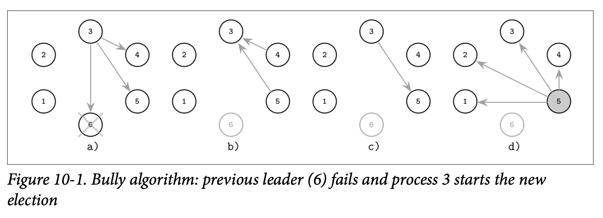

# Bully Algorithm

其中一个领导者选举算法称为 *Bully Algorithm*，他使用了处理器的排名来选择新的领导者。每个处理器都会被分配一个唯一的排名。在选举的过程中，具有最高排名的处理器会成为领导者。

这个算法因为他的简易性而广为人知，而他被命名为 *Bully* 是因为最高排名的节点 *Bullies* 强制其他的节点接受他成为领导者。他同时也被称为 *Monarchial* 领导者选举：最高排名的邻接节点会在前一个领导者退出后成为国王。

选举会在处理器发现系统中不存在领导者的时候 *(他不会通过初始化来设置)* 或是前一个领导者停止响应请求时启动，他会使用三个步骤来处理：

1. 处理器发送选举请求，请求中会附带较高级别的标识符
2. 处理器进行等待，等到更高排名的处理器做出响应，如果没有更高排名的处理器响应，他会进入步骤 3，否则处理器会发现接收到了更高排名的处理器的响应，他会等待该处理器进入步骤 3.
3. 处理器假设不存在其他活跃的具有更高排名的处理器，接着会通知其他所有低于其排名的处理器他成为了新的领导者。

Figure 10-1 展示了 Bully 领导者选举算法的过程

- *a)* 处理器 3 发现前一个领导者 6 已经崩溃了，然后通过发送选举信息跟更高的标识符来启动了新一轮的选举
- *b)* 4 跟 5 响应了 Alive 信息，因为他们具有比 3 更高的排名
- *c)* 3 发现了最高排名的处理器 5 做出了响应
- *d)* 5 被选举为新的领导者，他广播了选举成功的消息来通知其他低于其排名的处理器这次选举的结果

这个算法的一个明显的问题是他在产生网络分区的时候会违反了安全性的保证 *(同一个时刻最多只会有一个领导者被选出来)*。他很容易会导致节点被分裂成多个独立功能子集的情况，这时每个子集都会有子集的领导者。这种状况被称为 *Split Brain* 脑裂。

这个算法的另一个问题是对高排名的节点具有严重的偏向性，当这些节点不稳定的时候可能会导致无限的进行选举的情形。一个不稳定的高排名的节点会选择自己成为领导者，然后短时间内又出故障，然后又再次赢得选举，又再次故障，导致这个过程会无限的重复下去。这个问题可以通过在选举中分发节点的质量指标，并将其作为选举的考虑因素之一来解决。