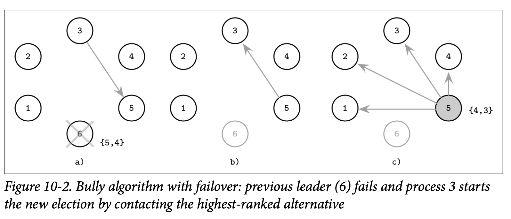

# Next-in-Line Failover

有许多 *Bully* 算法的变种尝试去提升他的许多属性，比如我们可以使用多个 *Next-in-line* 的替代处理器来进行故障转移，以此缩短重新选举的时间。

每个被选举出来的领导者会提供一个转移故障的节点列表。当任意一个处理器检测到领导者发生故障，他会从已故障提供的可替代节点中排名最高的处理器发送信息来开启新一轮的选举。如果其中一个提名的备用处理器是正常的，他就会直接成为新的领导者，而不需要执行整个完整的选举轮次。

如果一个检测到领导者已经崩溃的处理器是前领导者提供的列表中排名最高的，他可以直接通知其他的处理器他成为了新的 Leader。

Figure 10-2 展示了使用了这个优化方案的处理过程

- *a)* 领导者 6 设置了可替代的处理器列表为 [5, 4] 然后崩溃了，3 发现了领导者崩溃然后联系了 5 这个可替代列表中具有最高排名的处理器。
- *b)* 5 响应了 3 通知他自己还活跃着，防止他去联系可替代列表中的其他节点
- *c)* 5 通知了其他的节点他成为了新的领导者

最终的结果是，在 *next-in-line* 处理器列表存在活跃的处理器时，我们只需要少数的几个步骤就能完成选举。