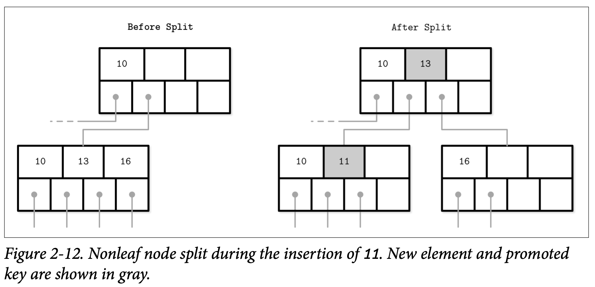
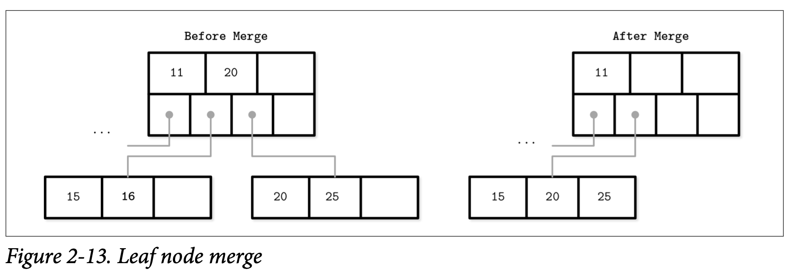
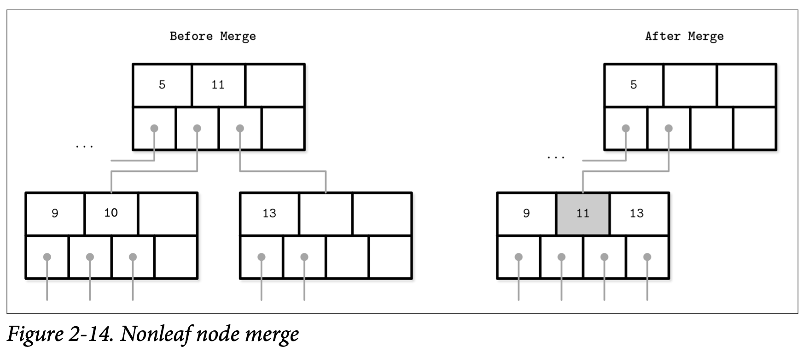

## Ubiquitous B-Trees

可以将 B-Trees 想象成一个图书馆中的巨大目录：首先你要找到正确的陈列柜，然后在这个柜上找到正确的书架，然后在这个书架上找到正确的抽屉，然后在抽屉中找到你正在寻找的那个卡片。类似的， B-Tree 构建了一个帮助使用者快速定位他想找的数据的层次结构。

如我们之前讨论过的二叉查找树，B-Tree 构建为一个平衡搜索树，但跟普通的搜索树的区别在于具有更大的扇出量 *(拥有更多的子节点)* 跟更小的高度。

在大部分的介绍里面，二叉树的节点都被描绘为一个圆。因为每个节点唯一的职责就是保存对应的键跟将对应的区间分为两部分，这个细节水平基本是很直观的。而 B-Tree 的节点一般会被描绘为一个矩形，还重点指出了指针块来描述子节点跟分隔键之间的关系。Figure 2-7 依次展示了二叉树、2-3-Tree 跟 B-Tree 的节点，这能够帮助我们了解他们之间的相同点及差别

没有什么能够阻止我们以相同的方式画出二叉树。这些数据结构都具有类似的使用指针的语义，他们的区别则是从如果管理其中的平衡开始。Figure 2-8 展示了 BST 跟 B-Tree 之间的类似的点：Key 会将树分裂成子树，并会用他来作为搜索目标的导航，你可以将它跟 Figure 2-1 做一下比较。

B-Tree 是有序的：在 B-Tree 中的 Key 都会按照顺序来存储。因此为了定位到需要查找的 Key 我们可以使用类似二分查找的算法。这同时也暗示了 B-Tree 的查找具有对数级别的复杂度。举例来说，为了在 40 亿个元素中查找某个目标需要进行 32 次比较，如果每次比较都需要在磁盘中进行寻址的话，会明显的拖慢整个过程，但因为 B-Tree 的节点存储了成打或上百个元素，我们可以只在每个层级上只执行一次磁盘寻址。查找算法更具体的细节会在本章的后面详细讨论。

使用 B-Tre，我们可以高效的执行点跟区间的查询。点查一般在查询语言中使用相等表达式表示，用来定义单条记录。另一种区间查询在查询语言中则一般使用比较表达式 *(如 <、>、≤、≥)* 来按查询一批有序的数据。

### B-Tree Hierarchy

B-Tree 由许多的节点组成，每个节点或保存最多 N 个 Key 跟 N+1 个指向子节点的指针。这些节点在逻辑上我们可以将他们分成三组：

- *Root node*

  没有父节点、位于树顶端的节点

- *Leaf nodes*

  位于树的底端、没有子节点的节点

- *Internal nodes*

  除了以上两种节点，剩下的就只有这种节点了，通过他们将树的根及叶子连接起来。这类节点一般会存在多个不同的级别 *(深度)* 中。

这个层级关系展示在 Figure 2-9 中

因为 B-Tree 是按照 *页* 来进行组织的 *(他们通常使用固定大小的页面尺寸)*，因此我们将 节点跟页 作为相同的概念交替着使用。

节点的 *capacity* 容量跟其中真实存储的 Key 的数量的关系我们称之为 *occupancy* 使用率。

B-Tree 的特点是他的扇出量: 即每个节点存储的 Key 的数量。更高的扇出量让节点中存储的 Key 跟指针能够集中保存在单个块或多个连续的块中，因此能够分摊为了保持树平衡所所需对做的修改成本以及减少对磁盘的访问量。保持平衡的操作 *(称为 splits 分裂跟 merges 合并)* 会在节点写满或接近空时触发。

> ### B^+^-Trees
>
> 我们介绍具有类似属性的树时都使用了 B-Tree 这个词。在前面所介绍的数据结构的更具体的名字其实是 B^+^-Tree。[KNUTH98] 将具有高扇出的树称为多路树进行了介绍。
>
> B-Tree 允许在树中任意层级的节点中存储数据：包括根、内部节点跟叶子节点。B^+^-Tree 则只允许将数据存储在叶子节点中。内部节点只存储了 *separator keys* 分裂键，他用来告诉查询算法对应的键会出现在哪个叶子中。
>
> 因为 B^+^-Tree 只会在叶子节点存储数据，所有的操作 *(插入、更新、删除跟查找)* 都只会对叶子节点产生修改，并在需要进行分裂跟合并时传播到更高的层级。
>
> B^+^-Tree 使用的非常广，我们跟其他的介绍一样将它称为 B-Tree，比如 [GRAEEE11] 中将 B^+^-Tree 作为默认的设计，在 MySQL 的 InnoDB 实现的 B^+^-Tree 也被称为 B-Tree。

### Separator Keys

保存在 B-Tree 节点中的 Key 一般称为 *index entries* 索引实体、*separator keys* 分裂键或 *divider cells* 分隔单元。他们将树分裂成了对应区间的多个子树 *(也成为 branches 分支或 subrange 子区间)*。这些 Key 会被有序的保存，因此能够对其使用二分查找。通过高层级的节点的 Key 及对应的指针能够找到对应的子树。

在节点中的第一个指针指向小于其第一个 Key 的子树，节点中的最后一个指针指向大于等于其最后一个 Key 的子树。其他指针所指向的子树中的 Key 都表达式 K~i-1~ ≤ K~S~ < K~i~ ，其中 K 是指所有 Key 的集合， K~S~ 在其子树中的 Key 集合。Figure 2-10 描述了这些特性

有一些 B-Tree 还保存了指向相邻节点的指针，不过他们一般存在于叶子节点，用于简化区间扫描操作。这些指针能够避免通过父节点来才能找到其相邻节点。有一些实现还使用了类似双向链表的两个指针来指向其前后两个相邻节点，这让他们可以实现对叶子节点进行反向的迭代。

让 B-Tree 与别不同的还有，不同于自顶向下 *(如二叉查找树)* 来构建树，他使用了另外一种自底向上的方式。当叶子节点增长时才会导致内部节点跟树的高度增高。

因为 B-Tree 为每个节点申请了额外的空间来供以后的插入跟更新使用，树的存储利用度可能会低于 50%，不过大部分情况下利用度会高得多。而更高的利用度并不用对 B-Tree 的性能产生负面的影响。

### B-Tree Lookup Complexity

B-Tree 查找的复杂度能从两个角度来观察：查找过程中发生的传输块的次数及比较的次数。

传输次数是以 N 为基础的对数 *(N 即每个节点的 Key 的个数)*。每个新的级别都会有 K 倍的子节点数，而因此往子节点继续查找时能减少的检索空间会以 N 为因子减少。在查找中最多有 $Log_k M$ *(M 是 B-Tree 中节点的总数)* 个页面会被用来查找指定的 Key。从根到最后叶子节点中需要被跟随引用的子指针跟所访问的级别数是相等的，也就是树的高度。

通过观察具体比较的次数，他是基数为 2 的对数，因为从节点中查找具体的 Key 是使用二分查找来完成的。每个比较都会减少一半的查找控件，因此复杂度为 $Log_2 M$。

了解查找磁盘的次数跟比较的次数的差别，能够帮助我们从两个方面更直观的理解查找是如何进行的，以及查找具体的复杂度。

在一些书跟文章中， B-Tree 查找的的复杂度常常被描述为 $Log M$。对数的基数通常不会在复杂度的分析中提起，因为更改这个基数只会改变其常量因子，而对常量因子所作的乘法并不会改变其复杂度。比如给一个非零的常量因子 C, $O(|C|\times n)$ == $O(n)$

### B-Tree Lookup Algorithm

现在开始我们会讨论到 B-Tree 的数据结构及其内部组织。我们会定义用来查找、插入以及删除的算法。为了从 B-Tree 中找到指定的元素，我们会沿着根到叶子执行一次查找，这次查找的目标是找到我们所需的 Key 或者是其前驱。找到指定 Key 是用来实现点查；而找到前驱对区间扫描跟插入都非常有帮助。

算法将从根及二分查找开始，将目标 Key 跟根中所存储的 Key 进行比较直到找到第一个大于该目标 Key 的分隔键，这样就能定位到下一个要查找的子树。就如我们之前讨论的，分隔键将树分裂成多颗由两个邻接键表示其边界的子树。当我们找到对应的子树时，我们跟着其指针对应的子树，然后继续执行相同的处理 *(定位分隔键，跟随指针找到子树)* 直到叶子层，在这一层我们可以找到目标 Key 或是根据其前驱来确认该 Key 不存在。

在每一个层级，我们都能获得关于该树更详细的信息：我们从最粗粒度的级别 *(树的根)* 沿着树的节点进入下一个键值区间更加明确的层级，直到达到能够用来定位具体数据的叶子层。

在执行点查时，查找会在找到或者没找到目标 Key 时终止。在执行区间查询时，迭代从最找到的最接近的键值对开始，然后沿着兄弟节点的指针一直前行直到区间指定的终点或是区间的检查失效。

### Counting Keys

在许多的文献中，你可以找到许多不同的描述键跟子节点偏移量计数的方式。[BAYER72] 提到针对具体设备的最佳的页面尺寸 $K$。在本例中的页能够保存 K 到 2K 个 Key，跟能够持有至少 K+1 到 2K+1 个指向子节点的指针。在后面还提到了使用 $l$  来表示定义每个非叶子的页能保存 $l + 1$ 个 Key。

在其他的资料中，如 [GRAEFE11]，提到了节点能够保存最多 N 个分裂键及 N+1 个指针，跟我们提到的语义及数量是类似的。

这些方式都实现了同一个目标，其中各个文献的差异主要在于具体数值的定义不同，为了清晰起见，在本书中我们坚持使用 $N$ 来表示 Key *(或键值对)* 的数量。

###  B-Tree Node Splits

为了往 B-Tree 中插入一个值，我们首先要定位到目标的叶子及具体可以插入的位置。为了达到这个目的，我们使用在上一个小节中描述的算法，定位到对应的叶子后将新的 Key 跟 Value 添加到他最后的位置。在 B-Tree 中进行更新的操作则是一样使用查找算法先定位到目标的叶子节点，然后将新的数据关联到现存的 Key 上。

如果目标的节点没有足够的空间，我们称该节点已经 *overflowed* 溢出并需要分裂成两部分来存放新的数据。更确切的说，节点在满足下面的条件时就会分裂：

- 对于叶子节点：如果节点能够保存最多 N 个键值对，插入新的节点会导致其超过了定义的最大容量 N
- 对于非叶子节点：如果节点能够保存最多 N + 1 个指针，插入新的指针会导致其超过其定义的最大容量 N + 1

节点的分裂通过下列操作完成，创建一个新的节点，从原有节点转移一半的元素到新节点，然后将其第一个 Key 跟指针添加到父节点中，这种情况我们称之为 Key 被提升了。导致这次分裂产生的索引位置称为 *split point* 分裂点 *(也被称为 midpoint 中点)*。所有在分裂点之后 *(如果是非叶子节点的分裂则包括分裂点本身)* 的元素被转移到新创建的邻接节点，其他的元素则依然保存在原节点中。

如果父节点已经满了，导致没有多余的空间来保存刚刚被提升的 Key 跟指针，那他也会进行分裂。这个操作会不断的往上传播直到根节点。

当树也增长到了其最高容量时 *(即分裂已经往上传播到了根节点)* 我们就需要将根节点也进行分裂，当根节点分裂后，新的根会保存导致分裂的分隔键。然后原本的根 *(现在保存了之前一半的元素)* 被降为下一级的节点，并紧随着其新创建的邻接节点，然后将树的高度提升了一级。树的高度会在根节点发生了分裂跟创建新的根时，或当两个节点被合并成一个新的根时发生改变。在叶子节点跟内部节点的级别内，树只会水平扩展。

Figure 2-11 展示了在叶子节点已经满的情况下插入新的 11 元素的情形。我们在满节点的中间画了一条线，把其中的一般元素留下，把另一半的元素移动到了新的节点。产生的分裂点则放到了原本节点的父节点上，作为分隔键。

Figure 2-12 展示了在插入元素 11 时造成非叶子节点上的分裂处理。为了处理分裂，我们创建了个新的节点，然后将其中索引从 $N/2+1$ 开始的元素都移过去。分隔点的键则上升到了父节点。

非叶子节点的分裂往往是因为其下级节点的分裂导致的，因为我们需要为其存储多一个指针 *(即下一级别中新创建的节点)*。如果父节点这个时候也没有足够的空间，则他也会同样发生分裂。

不管是叶子还是非叶子节点分裂都是正常的 *(区别只是说该节点包含了 Key 跟对应的 Value 还是只有 Key)*，如果是叶子节点分裂了，Key 会跟他相关联的 Value 一起被移到新的节点中。

当分裂完成后，我们有了两个节点，因此需要从中选择正确的那个来继续完成插入操作。所以我们要使用分裂键的不变式，如果插入的 Key 小于被提升的那个，我们将其插入到被分裂的那个节点中，否则的话，我们将他插入到新创建的那个节点。

作为总结，节点的分裂被由以下四步操作完成：

1. 创建一个新的节点
2. 从原有节点中复制一半元素到新的节点
3. 将新的元素放置到对应的节点中
4. 在原有节点的父节点中添加一个分裂键跟指针指向新的节点

### B-Tree Node Merges

删除操作首先由定位到目标叶子开始，当目标叶子成功定位后，对应的 Key 跟其关联的 Value 将会被删除。

如果被删除节点的邻接节点只有少量的元素 *(比如他的使用率小于某个指定的阈值)*，则邻接的节点会被合并。这种状况称之为 *underflow* 下溢。来介绍两个下溢的场景：如果两个相邻的节点属于同一个父节点并且他们的内容能够放到一个节点中，则他们应该被合并；如果他们的内容不能够放到一个节点中，则他们的 Key 会被重新分布，以实现重新平衡。更确切地说，两个节点在满足下面条件时被合并：

- 对于叶子节点：如果节点最多能够保存 N 个键值对，且与相邻节点的键值对个数之和小于等于 N
- 对于非叶子节点：如果节点最多能保存 N + 1 个指针，并且与相邻节点的指针之和小于等于 N + 1

Figure 2-13 展示了在删除元素 16 时发生的合并操作。我们将元素从其中一个邻接节点移到另一个，更一般来说，元素从右邻接节点移到其左边那个，但如果他们的 Key 是预生成的话，也可以使用其他的方法。

Figure 2-14 展示了在删除元素 10 时两个非叶子节点的合并操作。如果合并后的元素后只需要使用一个节点就可容纳，那我们就只需保留一个节点。在合并非叶子节点时，我们需要从他的父节点中把对应的分裂键拉下来一层。由较低层级节点的删除操作传播上来的的合并操作，可能会导致页被删除，所以对应的指针数会减少一个。跟分裂一样，合并也会往上传播知道根节点。

作为总结，节点的合并由下面三步操作完成，这里我们假设对应的元素已被删除：

1. 复制所有右相邻节点的元素到左的节点
2. 删除右节点在父节点中中的指针 *(在非叶子节点合并时则是下降)*
3. 删除右节点

在分裂跟合并后有一个需要实现的技术点称为 *rebalancing* 重平衡，我们会在后续对应的章节讨论。

### Summary

在本章中，我们为基于磁盘的存储创建了一个特定的数据结构。二叉查找树跟其有类似的特点，仍有扇出量低、大量分配及更新指针等问题导致其不适合在磁盘中使用。B-Tree 通过增加每个节点的子节点数 *(搞扇出)* 跟更少平衡操作来解决这些问题。

之后，我们讨论了 B-Tree 内部的数据结构以及查找、插入、删除操作算法的轮廓。分裂跟合并操作帮助我们在新增及删除元素后能够重新构建树以保持其平衡。我们保持了树的高度尽量的低并在仍有空闲空间时将元素添加到已存在的节点中。

我们也可以使用这些方法来创建基于内存的 B-Tree。创建基于磁盘的数据结构，我们需要深入到细节中去了解 B-Tree 在磁盘上的布局，并将数据以基于磁盘的编码格式进行组合。

> ### Futher Reading
>
> 你可以从下面的资源来了解更多跟本章概念相关的东西，
>
> - Binary search trees
>
>   Sedgewick, Robert and Kevin Wayne. 2011. Algorithms (4th Ed.). Boston: Pearson.
>
>   Knuth, Donald E. 1997. The Art of Computer Programming, Volume 2 (3rd Ed.): Seminumerical Algorithms. Boston: Addison-Wesley Longman.
>
> - Algorithms for splits and merges in B-Trees
>
>   Elmasri, Ramez and Shamkant Navathe. 2011. Fundamentals of Database Systems (6th Ed.). Boston: Pearson.
>
>   Silberschatz, Abraham, Henry F. Korth, and S. Sudarshan. 2010. Database Sys‐ tems Concepts (6th Ed.). New York: McGraw-Hill.

