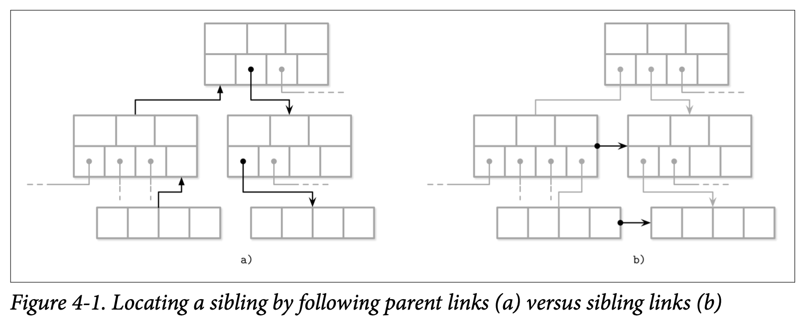
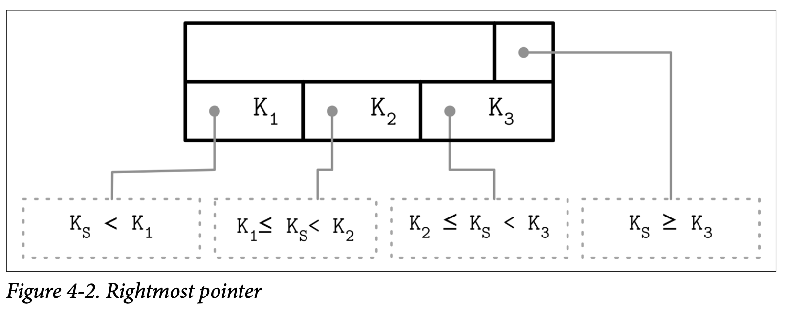
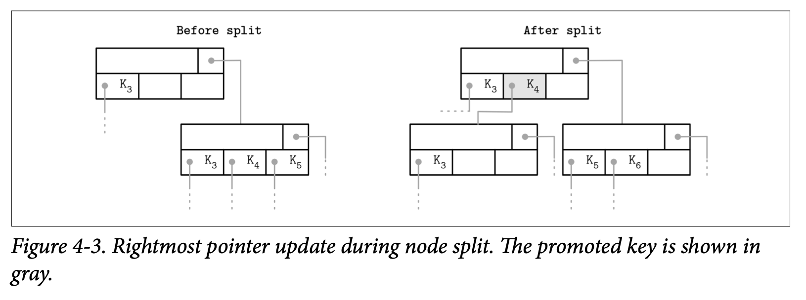
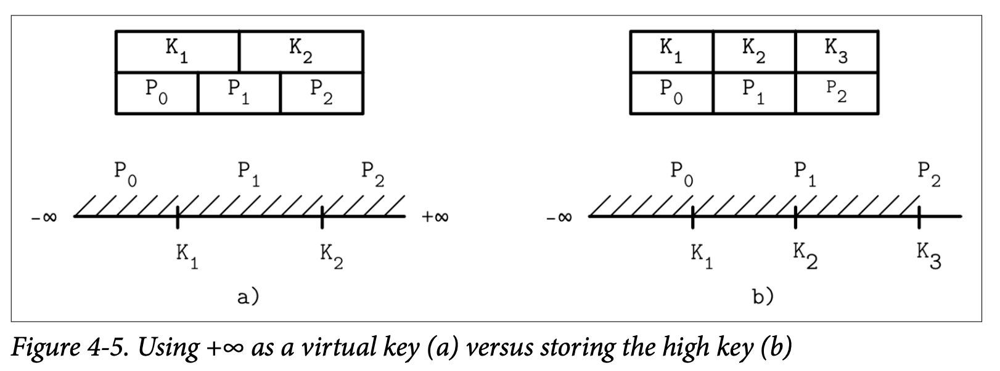
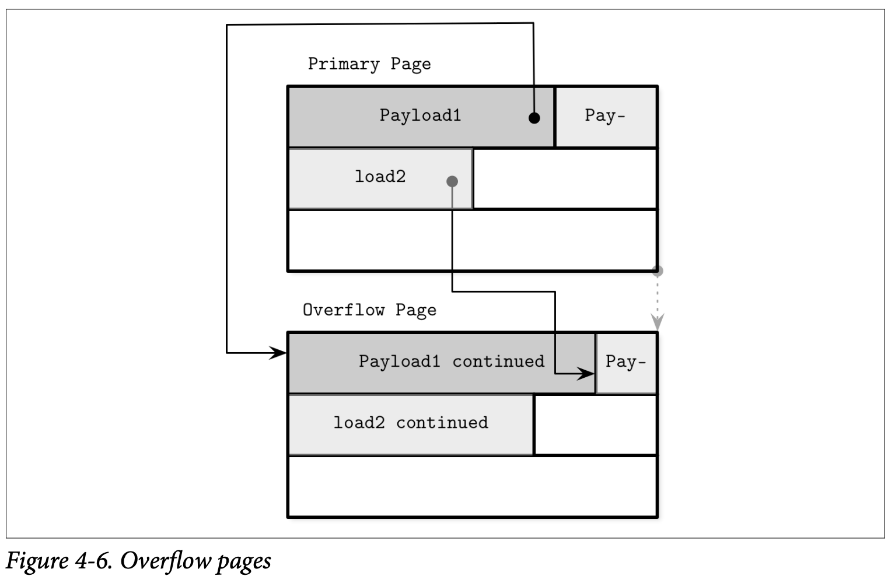

## Page Header

页的头部信息保存了用来进行数据导航、管理跟优化相关的信息。通常情况下会包含一个用来描述页内容跟布局类型的 *flags* 标志，页中所具有的 Cell 数量，空闲空间的高位及低位的偏移量 *(用来 Cell 跟数据)* 以及其他有用的元数据。

比如 PostgreSQL 则将页的大小及布局版本保存到了头信息中，在 MySQL 的 InnoDB 中，页的头部还包含了数据记录的数量、级别跟其他实现所需的值，在 SQLite 中，页的头部保存了 Cell 的数量以及当前最右位置的指针。

### Magic Numbers

我们经常会将一个称为 *magic number* 魔法数字的值写到文件或是页的头部中，他通常是多个字节组成的块，其中包含一个可以用来标记的常量，比如用来表示页中的块，说明其类型，或确认其版本。

魔法数字常常被用来验证跟做正确性检查。确认魔法数字的正确性对偏移量的计算是非常重要的，如果该数字是正确的，那其中偏移量正确的可能性是很高的。比如为了验证页面被正确的读取跟对齐，在写入数据时我们会将魔法数字 50 41 47 45 *(Page 的16进制)* 写到头部，之后再读取的时候，我们通过验证头部信息是否有我们预期的字节数据来确认页的合法性。

### Sibling LInks

有一些实现会保存向前及向后的连接，用来指向其左边跟右边的相邻页。这些链接能够帮助我们快速定位相邻的节点，而无需上升到父节点再进行查找。这个方式同样也添加了分裂及合并操作的复杂度，因为发生对应操作时需要更新相关邻接页的偏移量。比如，当一个非最右的节点分裂了，他的有邻接节点的向后的指针需要指向新创建的节点。

在 Figure 4-1 中你可以看到为了定位相邻的节点，除非我们建立了相邻节点的链接，否则的话就会需要通过父节点来进行查找。这个操作可能会一直上升到根节点才能完成，因为直接的父节点可能只指向了自己的子节点。如果在头部信息中存储了相邻节点的连接，可以简单的使用他们来定位到同一级别的上一个或下一个节点了。

存储相邻节点连接的一个缺点是需要在分裂跟合并的时候去更新他们。因为需要更新相邻的节点，而不只是在分裂跟合并的节点，因此可能会需要额外的锁定机制。在后续的 Blink-Tree 章节中我们会讨论相邻节点的连接在并行的 B-Tree 实现中的用处。

### Rightmost Pointers

B-Tree 的分隔键具有严格的不变性：他们被用来将树分割成子树及作为子树的导航，因此永远会多出一个指向子页的指针。这也是为什么 *Counting Keys* 中会说 +1。

在 *Separator Keys* 分隔键中我们讨论了分隔键的不变性。在许多的视线中，节点跟 Figure 4-2 所示的更像：每个分隔键都有子节点的指针，但其最后一个指针是单独存储的，因为他并不会跟其他的 Key 成组，你可以用他跟 Figure 2-10 做一下比较。

这个额外的指针可以存储在头部中，比如像 SQLite 就是这样做的。

如果最右的子节点被分裂出了新的节点，并添加到了父节点上，此时最右的子节点就需要被重新赋值了。如 Figure 4-3 所示，在分裂之后， 被添加到父节点的 Cell *(灰色的那个)* 保存了被提升的 Key 及指针。指向新节点的指针会用来替换掉原本的最后节点指针。相同的方式在 SQLite 中都会有人讨论。

### Node High Keys

我可以使用一种稍微不同的方式，将最右节点的指针保存到位于 Cell 之后一个称为 *high key* 的节点中。*high key* 表示当前节点的子树所能表示的最大的 Key。这种方式被 PostgreSQL 使用，并将其命名为 B^link^-Trees​ *(这种方式对并发的影响可以查看具体的 Blink-Tree 章节)*。

B-Tree 有 N 个 Key *(缩写为 $K_i$)* 以及 N+1 个指针 *(缩写为 $P_i$)*。在每个子树中，Key 的边界使用 $K_{i-1} <= K_s < K_i$ 来表示，并且隐含着 $K_0 = -\infty$，这些都不会直接的在节点上表现。

B^link^-Tree 为每个节点添加了 K~N+1~，他表示了指针 P~N~ 指向的子树中能够存储的  Key 的上限。因此也是能够存储在该子树的值的上限。Figure 4-4 分别展示了两种方式：(a) 展示了不包含 high key 的节点，(b) 展示了包含 high key 的节点。

在这个场景指针会成对的存储，并且每个 Cell 都会有其对应的指针，这能够简化跟减少处理 rightmost 指针时的边界条件。

在 Figure 4-5 中，你可以看到两种方式的页面结构示例，以及他们的搜索空间在这些场景中是如何被分割的：第一种使用了 $+\infty$ 表示上限，第二种则使用了 $K_3$ 作为上限。

### Overflow Pages

节点的大小跟树的扇出量是固定并且不能够动态变更的。我们很难得出一个通用的优化方案：如果可变长度的 Value 足够大，那一个页就只能保存少数几个；如果 Value 足够小，又会造成较多的空间被浪费。

B-Tree 的算法指定了每个节点应该保存指定数量的元素。因为有些 Value 的大小是不同的，我们可能会遇到这样的情况：根据 B-Tree 算法的定义，节点可能未被填满，但该固定大小的页却已经没有足够的空闲空间来该节点了。重新设定该页面的大小的话，会导致页面中已经写入的数据需要移动到新的区域，这是不大现实的。因此，我们需要一种方式能够去增大或是扩展页的大小。

为了实现无需复制数据到新的连续区域的动态长度节点，我们可以将节点构建为多个连接的页。比如默认的页尺寸是 4K，在插入一些数据之后，他的数据已经超过了 4K。我们允许节点以 4K 为基数增长，而不是只将大小固定为 4K，所以分配了大小为 4K 的扩展页并将其连接到原本的页面后。这些建立的扩展页称为 *overflow pages* 溢出页，更明确一点，在本节的后续我们称原本的页为 *primary page*。

大部分 B-Tree 的实现最多只允许在节点中保存其节点大小的数据，并将剩余部分的数据保存到溢出页。这个值通过用节点的大小除以扇出量得到。使用这种方式，我们就不会再遇到页空间不够使用的情形了，因为页至少会有 *max_payload_size* 个字节。更多关于 SQLite 中溢出页的细节可以参考 [SQLIte source code repository](https://databass.dev/links/16)； 也可以从 [MySQL InnoDB 的文档](https://databass.dev/links/17) 中找到。

在插入数据的大小超过了 *max_payload_size* 时，会检查他是否已经有了关联的溢出页，如果溢出页已存在并且具有足够的空间，则超出部分的数据会被保存到溢出页中。否则将分配新的溢出页。

在 Figure 4-6 中，可以看到 *primary page* 跟 *overflow page* ，以及 *primary page* 的记录中会包含指向溢出页中对应溢出数据的指针。

溢出页需要一些额外的簿记信息，因为他们可能会跟 *primary page* 一样产生碎片问题，所以我们回收他的空间用来写入数据，或是在不需要时丢弃整个溢出页。

当第一个溢出页被创建时，他的页 ID 会被保存到 *primary page* 的头部信息中。如果一个溢出页不够用，那这些溢出页将会通过在他们各自的头部信息保存其前一个溢出页的 ID 来建立连接。因此可能需要遍历多个溢出页才能够定位到想要的溢出数据。

因为 Key 通常具有较高的基数，将他们保存到一起让大部分的比较在 *primary page* 中完成。

对于数据记录，则需要定位出他们溢出部分在溢出页的位置，才能读取出来返回给用户。但是这一部分并不是非常重要，因为类似操作的频率并不是很高。如果所有的数据记录都溢出了，那更应该考虑使用专门的 *blob* 存储来保存这些大的数据。