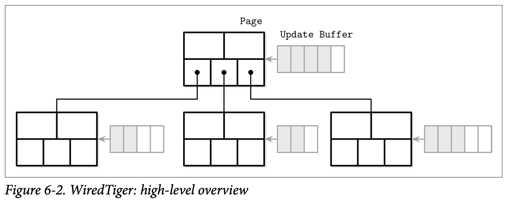
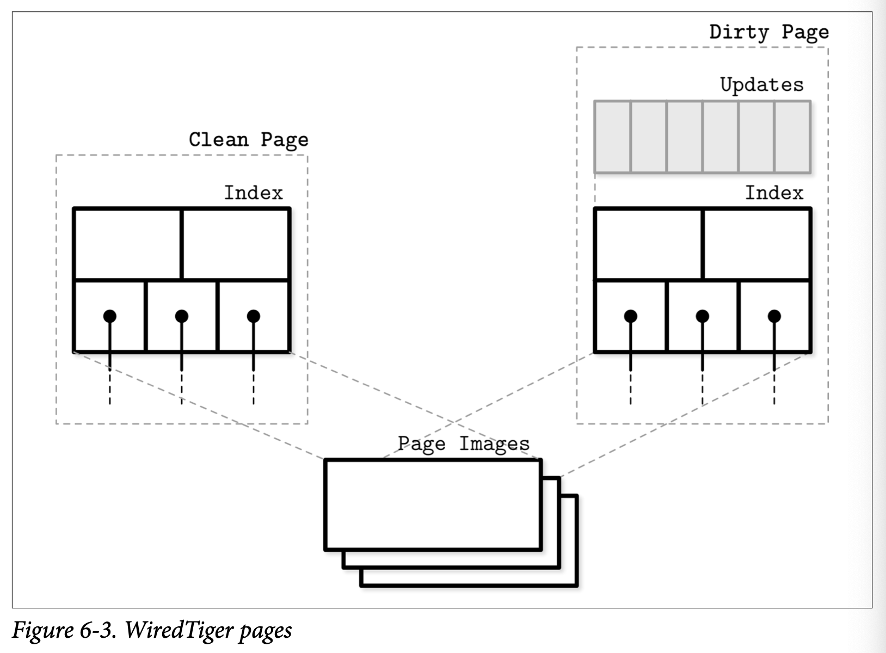
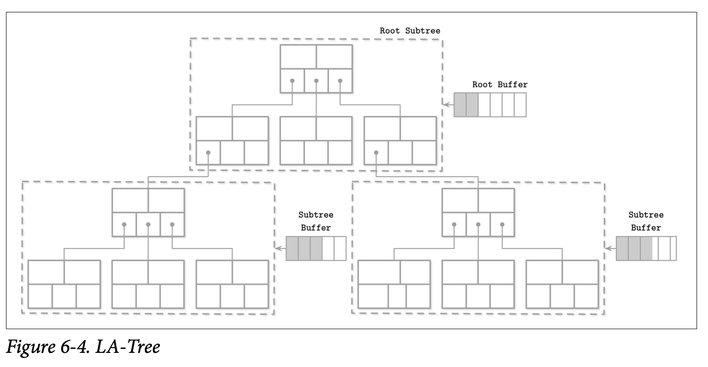

## Lazy B-Trees

有一些算法 *(在本书我们将它成为 lazy B-Trees)* 降低了更新 B-Tree 的成本，他们使用更轻量的并发跟缓存友好的内存数据结构，来缓存更新操作并推迟了这些操作的传递。

### WiredTiger

现在来看看如何使用缓冲来实现 *lazy B-Tree*，为了实现这个目标，我们可以在页被加载到缓存时使用指定的数据结构将它保存到内存，并在合适的时候将其写回磁盘。

MongoDB 的默认存储引擎 *WiredTiger* 使用了一个类似的方式，他是一个基于行的 B-Tree 实现，并且在内存跟磁盘中使用了不同的存储形式。在内存中的页被持久化之前，他们需要先进行协调的操作。

在 Figure 6-2 中，你可以看到 WiredTiger 页以及他在 B-Tree 中大致的表现形式。干净的页只会包含从磁盘页镜像构建的索引信息，之后更新的操作则会仙贝保存到 *update buffer* 中。

*Update buffers* 会在进行读取时被使用：他的内容会跟原本的磁盘中的页内容进行合并，来返回最新的数据。当页被刷到磁盘时，*update buffer*  的内容会跟页的内容整合并持久化到磁盘中，重写磁盘中原本的页。如果整合后的页大小超过了最大的限制，则该页会被分裂成多个页。*Update buffers* 使用了 *SkipList* 来实现，他跟查找树有相近的复杂度，但能够提供更好的并发性能。

Figure 6-3 分别展示了 WiredTiger 内存中干净的页跟脏页，以及他们在磁盘中所关联的镜像。脏页相对于干净的页会多了一个 *Update buffer*。

这个方式最大的好处是页的更新跟数据结构的修改 *(分裂跟合并)* 是通过后台线程来执行的，所以读写的操作不需要一直等待到操作完全完成。

### Lazy-Adaptive Tree

相对于将单独节点的更新进行缓冲，我们可以将多个节点组成一个子树，然后为其添加 *update buffer* 来批量处理每颗子树中的操作。*Update buffers* 在这个场景中会用来跟踪从子树根顶层及其各层下级节点的所有操作。这个算法称为 *Lazy-Adaptive Tree (LA-Tree)*。

在插入数据记录时，新的条目会先添加到根节点的 *update buffer* 中，当缓存满的时候，会将具体的变更复制跟传递到更下一级的树节点缓存里，然后清空根的缓存。这个操作在下一级节点也满的时候会持续递归到更下一级中去，直到到达叶子节点为止。

在 Figure 6-4 中可以看到 LA-Tree 为每一课由节点组成的子树都维护了一个缓存，灰色的盒子表示从根节点的缓存传递下来的变更。

缓存之间有着层级结构并且是有级联关系的：所有的更新都会从较高层级的缓存中传递到较低层级的缓存，当变更操作触达叶子级别的时候，对应的插入、更新跟删除操作才会被批量执行，一次性的将所有的变更应用到树中。因为没有单独的在每颗子树上执行更新，页可以在一次执行中完成他的更新，因此需要更少的磁盘访问及更少的数据结构变更，因为传递到上级的分裂跟合并操作也会是批量完成的。

这个缓存使用批量写入的操作来优化了树更新所需的时间，但使用了稍微不同的方式。这些算法都需要在内存查找额外的缓存结构，然后合并或是跟磁盘上的数据。

