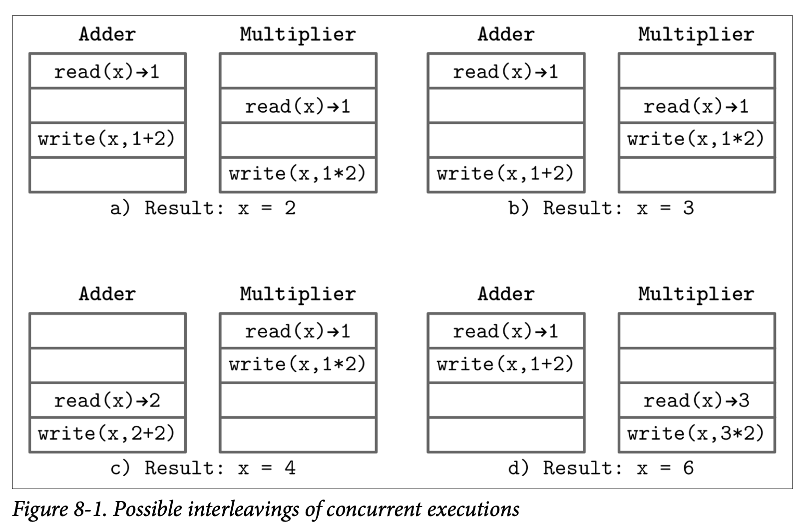

# Concurrent Exceution

当我们开始使用两个线程来对访问这个变量时，除非时处理的步骤在线程间同步，否则具体的结果在并行的执行步骤中将变得无法预测。现在相对于单线程的单个执行结果，我们可能会遇到 4 中不同的结果，如 Figure 8-1 所示：

- a) x = 2，如果每个线程都读到了变量的初始值，然后加法操作写入了执行的结果，但是接着变量被乘法操作以相乘的结果重写了
- b) x = 3，如果每个线程都读到了变量的初始值，然后乘法操作写入了执行的结果，但是接着变量被加法操作以相加的结果重写了
- c) x = 4，如果乘法操作在加法执行之前完成了他的操作
- d) x = 6，如果加法结果在乘法执行之前完成了他的操作

尽管我们还没有跨越单个节点的便捷，我们已经遇到了分布式系统中的第一个问题了：*Concurrency* 并发。每个并发的程序都跟分布式系统有相同的属性。线程需要访问共享的状态，在他本地的环境中执行一些操作，并且将执行的结果传递会共享的变量中。

为了能够精确的定义执行的路线跟减少可能产生的结果。我们需要一个 *Consistency Models* 一致性模型。一致性模型描述了参与者并行执行以及操作之间的顺序及这些操作之间的可见性。使用不同的一致性模型可以用来加强或弱化限制系统可能处于的状态的可能性。

在分布式系统跟并行计算中有许多重叠的术语跟研究，但他们是具有许多不同性的。在并行系统中，我们可以有 *Shared Memory* 共享内存，处理器可以使用他来交换信息；在分布式系统中，每个处理器具有他本地的状态，并且参与者之间需要用消息传递来进行通信。

> ## Concurrent and Parrllel
>
> 我们有时会交替着使用 *Concurrent* 并发跟 *Parallel* 并行，但这两个概念在语义上是有些区别的。当两个步骤的序列并发的执行时，他们可能会同时都处于运行中，但在同一个时刻里，他们中只会有一个是正在执行的。如果两个步骤的序列正在并行执行时，他们的步骤是可以同时执行的。并发执行的操作在时间上是交替进行的，并行执行的操作则是会在多个处理器上执行。
>
> Joe Armstrong 创建了 Erlang 这门编程语言，他给了个例子：并发的执行就如有两个队列在使用一个咖啡机，并行的执行就如有两个队列整在使用两台咖啡机。并且，大部分使用了多个并行执行线程的系统都会使用 *Concurrency* 并发这个术语，很少会使用 *Parallelism* 并行。

## Shared State in a Distributed System

我们可以尝试介绍一下共享内存在分布式系统中的概念，比如一个单点的信息源：一个数据库。尽管我们解决了并发访问数据库的问题，但仍然没办法保证各个处理器之间都是处于同步的。

为了访问数据库，处理器需要通过通信媒介来发送跟接收消息，并以此来进行查询跟修改数据库的状态。但是，如果其中一个处理器长时间没有收到来自数据库的响应的话会发生什么事呢？为了回答这个问题，我们首先来定义 *longer* 更长的时间意味着什么，首先这个系统应该被描述为 *Synchrony* 同步的：尽管通信的过程是异步的，或者会基于某种时序上的假设，这个时序的假设让我们能够引入操作的超时跟重试。

我们不知道数据库到底是因为负载过高、不可用、非常缓慢还是因为其他的一些网络问题导致没有响应。这里描述了一种崩溃的 *nature* 本质：处理器可能因为无法参与来执行算法的步骤而崩溃，进入了一个临时的无效状态，或者因此错失了一些信息。在决定如何处理故障之前，我们需要来定义 *Failure Model* 故障的模型来描述可能产生的故障会有哪些。

一个用来说明系统可靠性或者是出现错误时能否继续正常执行的属性叫做 *Fault Tolerance* 容错性。故障是无法避免的，因此我们需要使用可靠的组件来构建整个系统，比如排除上面提到的一个单点数据库的问题，就是我们开始这个方向的第一步。我们可以通过添加一些冗余或者一些备用的数据库来实现这个目标，但是这样我们又需要面对另一个不同的问题了：我们要如何让 *multiple copies* 多个副本的状态保持同步。

到目前为止，尝试在我们简单的系统中添加共享就让我们陷入了更多的问题需要去解答。现在我们知道处理共享状态并不像只是引入数据库那么简单，需要处理更细粒度的状态变化以及描述各个独立的处理器之间通过消息传递所产生的交互。